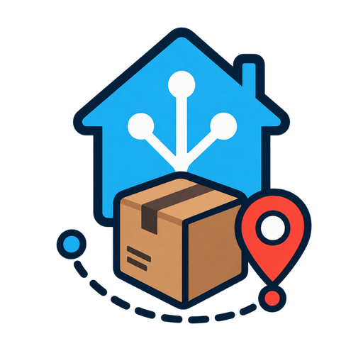

# 17TRACK for Home Assistant



A Home Assistant custom integration for [17TRACK](https://www.17track.net/), a universal package tracking service. Register your packages on the 17TRACK website or app, and this integration will surface each one as a sensor entity in Home Assistant.

## Features

- One sensor per package registered on your 17TRACK account, created and removed automatically.
- Sensor state is a human-readable sentence: `On <date> package "<name>": <latest event>`.
- Attributes with structured data (tracking number, carrier, package status, last event time) for use in automations and dashboards.
- Polls the 17TRACK API every 15 minutes. This only reads existing data (`gettracklist`), so it never consumes your registration quota, however often it runs.
- A `track17.register_package` service (and matching `input_text` + automation pattern, see below) to register a new tracking number from Home Assistant, optionally with a custom tag/name.
- A "Delete delivered packages" button and matching `track17.delete_delivered_packages` service to immediately clear out every delivered package from 17TRACK. Delivered packages are also removed automatically on every 15-minute poll, so the button/service is mainly useful when you don't want to wait for the next poll.

You can also register tracking numbers directly via the 17TRACK website or app; this integration will pick them up automatically either way.

## Registering a package

Call the `track17.register_package` service with a `tracking_number` and an optional `tag` (a custom label shown instead of the raw tracking number, both on the sensor and to voice assistants):

```yaml
action: track17.register_package
data:
  tracking_number: "YT2534627690112345"
  tag: "Csapágy"
```

## Installation

### Via HACS

1. In HACS, go to **Integrations** → menu (⋮) → **Custom repositories**.
2. Add this repository URL (`https://github.com/szajbergyerek/ha-17track`) with category **Integration**.
3. Search for **17TRACK** in HACS and install it.
4. Restart Home Assistant.

### Manual

1. Copy the `custom_components/track17` folder into your Home Assistant `config/custom_components/` directory.
2. Restart Home Assistant.

## Configuration

1. Go to **Settings** → **Devices & services** → **Add integration**.
2. Search for **17TRACK**.
3. Enter your 17TRACK API key (found in your 17TRACK account under **Security Setting**).

## Using with voice assistants

To let Assist (or any exposed conversation agent) answer questions like "where are my packages", expose the `track17` sensors under **Settings** → **Voice assistants** → **Entities**.

Expose the "Delete delivered packages" button the same way to let Assist delete every delivered package on command (e.g. "press the delete delivered packages button").

## Deleting delivered packages

Delivered packages are removed from 17TRACK (and disappear from Home Assistant) automatically the next time the integration polls, at most 15 minutes after delivery. To remove them immediately instead of waiting for the next poll:

- Press the **Delete delivered packages** button on your dashboard, or
- Call the `track17.delete_delivered_packages` service from an automation or script.

Both delete every package currently marked `Delivered` from 17TRACK and immediately refresh the remaining sensors.

## License

MIT, see [LICENSE](LICENSE).
